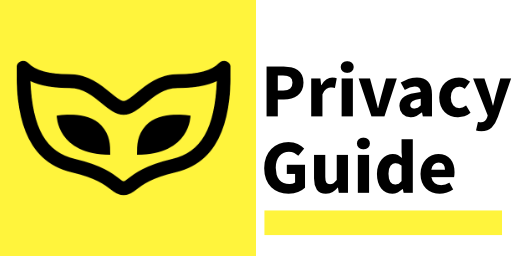
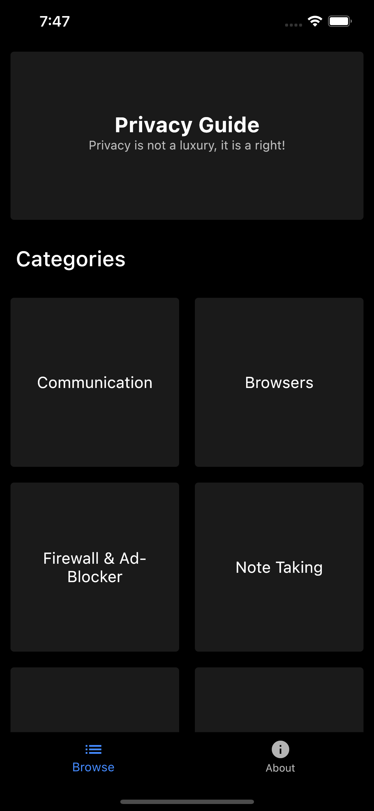
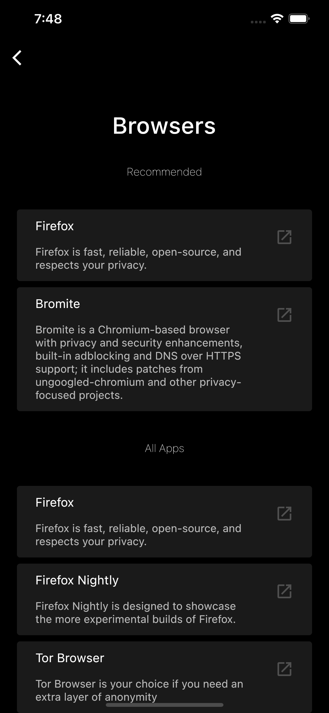
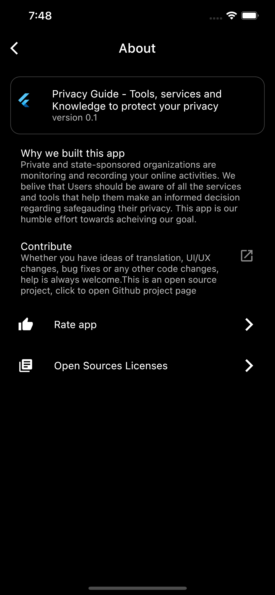

# Welcome to Privacy Guide 👋

[](#)



> Flutter app to help you find tools, services and knowledge to protect your privacy.

## Install

```sh
flutter run
```

## Screenshots:

   

## TODO

- [ ] Splash Screen
- [ ] Dynamic theme support
- [ ] App favorites (stateful)
- [ ] Add app search (global or local)

## Show your support

Give a ⭐️ if this project helped you!

> This project is heavily inspired by `privacytools.io` and `r/privacy`.
